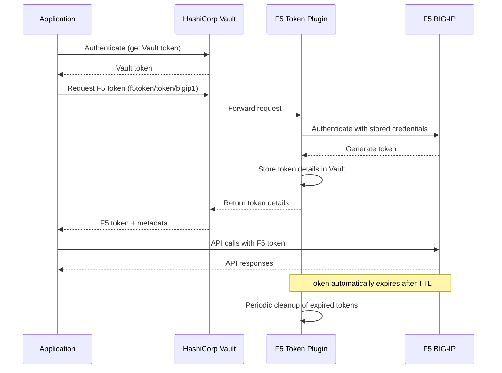
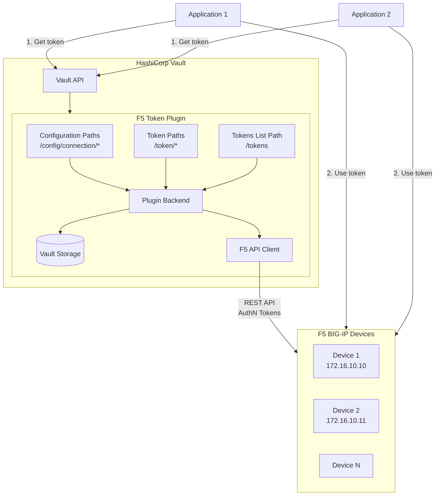
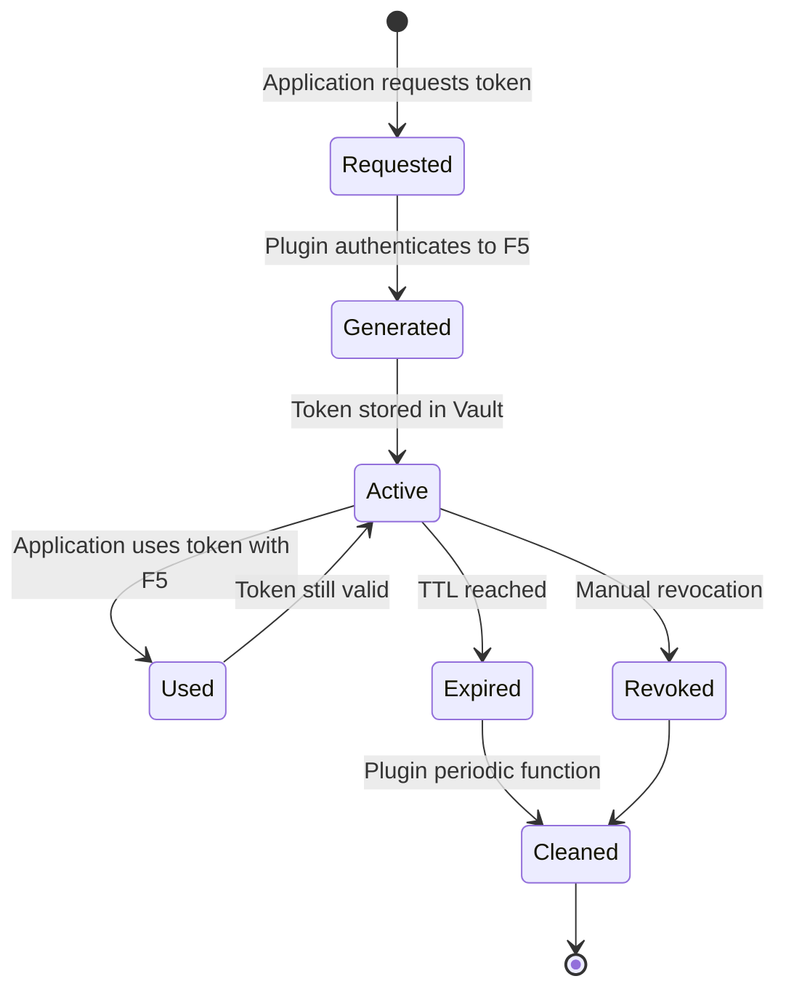

# F5 BIG-IP Token Plugin Flow Diagrams

This document contains visual diagrams of the F5 BIG-IP Token Plugin workflows.

## Token Generation and Usage Flow

## Plugin Architecture

## Token Lifecycle

